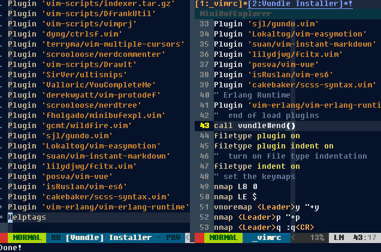

# winX 的 gvim 配置项


## [在线文档](https://xiaomiwujiecao.github.io/use_vim_in_winX/#/)

[Full Documentation](https://xiaomiwujiecao.github.io/use_vim_in_winX/)

## 前言


### 精简配置

按照 `use_vim_as_ide` 的配置， `windows` 需要的环境略显不同。
`unix` 或 `linux` 的环境相对比较完善，而如果你的开发需求不是使用 `vim` 作为 `c++` 的主要开发工具的话
你完全可以精简自己的配置文件。

### 适配程度

`unix` 和 `linux` 都有源码编译的版本，`windows` 因为字体、字符集、配置路径等小因素，
导致我们 `windows` 的工具无法完美的和 `linux` 的 `vim` 编辑器相适配。


## 突破点

`gvim` 的版本信息：

```text
$ vim --version
VIM - Vi IMproved 8.2 (2019 Dec 12, compiled Dec 15 2019 23:09:58)
MS-Windows 32 位控制台版本
包含补丁: 1-12
编译者 appveyor@APPVYR-WIN
巨型版本 无图形界面。  可使用(+)与不可使用(-)的功能:
+acl                +eval               +multi_byte_ime/dyn -tag_old_static
+arabic             +ex_extra           +multi_lang         -tag_any_white
+autocmd            +extra_search       +mzscheme/dyn       +tcl/dyn
+autochdir          -farsi              -netbeans_intg      +termguicolors
+autoservername     +file_in_path       +num64              +terminal
-balloon_eval       +find_in_path       +packages           -termresponse
+balloon_eval_term  +float              +path_extra         +textobjects
-browse             +folding            +perl/dyn           +textprop
++builtin_terms     -footer             +persistent_undo    -tgetent
+byte_offset        +gettext/dyn        +popupwin           +timers
+channel            -hangul_input       -postscript         +title
+cindent            +iconv/dyn          +printer            -toolbar
+clientserver       +insert_expand      +profile            +user_commands
+clipboard          +job                +python/dyn         +vartabs
+cmdline_compl      +jumplist           +python3/dyn        +vertsplit
+cmdline_hist       +keymap             +quickfix           +virtualedit
+cmdline_info       +lambda             +reltime            +visual
+comments           +langmap            +rightleft          +visualextra
+conceal            +libcall            +ruby/dyn           +viminfo
+cryptv             +linebreak          +scrollbind         +vreplace
+cscope             +lispindent         +signs              +vtp
+cursorbind         +listcmds           +smartindent        +wildignore
+cursorshape        +localmap           +sound              +wildmenu
+dialog_con         +lua/dyn            +spell              +windows
+diff               +menu               +startuptime        +writebackup
+digraphs           +mksession          +statusline         -xfontset
-dnd                +modify_fname       -sun_workshop       -xim
-ebcdic             +mouse              +syntax             -xpm_w32
+emacs_tags         -mouseshape         +tag_binary         -xterm_save
     系统 vimrc 文件: "$VIM\vimrc"
     用户 vimrc 文件: "$HOME\_vimrc"
 第二用户 vimrc 文件: "$HOME\vimfiles\vimrc"
 第三用户 vimrc 文件: "$VIM\_vimrc"
      用户 exrc 文件: "$HOME\_exrc"
  第二用户 exrc 文件: "$VIM\_exrc"
       defaults file: "$VIMRUNTIME\defaults.vim"
编译方式: cl -c /W3 /nologo  -I. -Iproto -DHAVE_PATHDEF -DWIN32  -DFEAT_CSCOPE -DFEAT_TERMINAL -DFEAT_SOUND  -DFEAT_JOB_C
HANNEL      -DWINVER=0x0501 -D_WIN32_WINNT=0x0501 /MP -DHAVE_STDINT_H /Ox /GL -DNDEBUG /arch:IA32 /Zl /MT -DFEAT_MBYTE_IME -DDYNAMIC_IME -DDYNAMIC_ICONV -DDYNAMIC_GETTEXT -DFEAT_TCL -DDYNAMIC_TCL -DDYNAMIC_TCL_DLL=\"tcl86t.dll\" -DDYNAMIC_TCL_VER=\"8.6\" -DFEAT_LUA -DDYNAMIC_LUA -DDYNAMIC_LUA_DLL=\"lua53.dll\" -DFEAT_PYTHON -DDYNAMIC_PYTHON -DDYNAMIC_PYTHON_DLL=\"python27.dll\" -DFEAT_PYTHON3 -DDYNAMIC_PYTHON3 -DDYNAMIC_PYTHON3_DLL=\"python37.dll\" -DFEAT_MZSCHEME -I "C:\Program Files (x86)\Racket\include" -DMZ_PRECISE_GC -DDYNAMIC_MZSCHEME -DDYNAMIC_MZSCH_DLL=\"libracket3m_a36fs8.dll\" -DDYNAMIC_MZGC_DLL=\"libracket3m_a36fs8.dll\" -DFEAT_PERL -DPERL_IMPLICIT_CONTEXT -DPERL_IMPLICIT_SYS -DDYNAMIC_PERL -DDYNAMIC_PERL_DLL=\"perl528.dll\" -DFEAT_RUBY -DDYNAMIC_RUBY -DDYNAMIC_RUBY_VER=24 -DDYNAMIC_RUBY_DLL=\"msvcrt-ruby240.dll\" -DFEAT_HUGE /Fd.\ObjCULYHTRZi386/ /Zi
链接方式: link  /nologo /opt:ref /LTCG:STATUS oldnames.lib kernel32.lib advapi32.lib shell32.lib gdi32.lib  comdlg32.lib
ole32.lib netapi32.lib uuid.lib /machine:i386   libcmt.lib  user32.lib  /nodefaultlib:lua53.lib  /STACK:8388608  /nodefaultlib:python27.lib /nodefaultlib:python37.lib   "C:\Tcl\lib\tclstub86.lib" winmm.lib WSock32.lib /PDB:vim.pdb -debug

```

## 可选项：源码编译

关于编译器 `cl` ：

> `cl.exe` 是控制 `Microsoft C ++` （`MSVC`）`C` 和 `C ++` 编译器和链接器的工具。 
> `cl.exe` 只能在支持`Windows` 的 `Microsoft Visual Studio` 的操作系统上运行。

关于编译器的详细信息：

请参考：[Compiler Options](https://docs.microsoft.com/en-us/cpp/build/reference/compiler-options?redirectedfrom=MSDN&view=msvc-160)

如果需要自己编译，可以根据上面的版本信息的输编译方式节点的内容，自定义您自己的配置项。

当然，源码需要到 `vim` 的 `github` 页上寻找


## 所需环境

如果直接使用，不想配置关于 `C++` 更多的内容，你可以参考我目前配置的 gvim 截屏。

同样的，你可以按照 [use_vim_as_ide](https://github.com/yangyangwithgnu/use_vim_as_ide)  的讲解
，在 `ubuntu` , `susu`, `redhat` 等 `linux` 发行版系统或 `mac book` 上配置你的专属 `IDE`
 
如果仅仅是使用以上配置的常用插件功能，您可以按照如下的提示配置你的 gvim：

- python 2.7 32 bit 安装包
- python 3.7 32 bit 安装包
- ctags 安装包
- gvim 8.2 的安装包

这些文件会在 release 版本中

下载地址:https://github.com/xiaomiwujiecao/use_vim_in_winX/releases/tag/download


## 配置 vundle 插件管理包

如果你按照 use_vim_as_ide 的配置方式，直接克隆到 HOME 目录下， 那么有可能  vundle 并不会启动。

原因实际上源自系统的隔膜。

当然，好的方式是直接切换到安装 VIM 的路径中，然后克隆到对应版本文件目录下的 vundle 目录中

例如：

如果是 82 版本的，那么你可以切换到 82版本的目录下 ，然后克隆 vundle 至 对应的目录

```bash
gcl https://github.com/VundleVim/Vundle.vim.git bundle/Vundle.vim
```

## 配置插件

剩下的就是配置您的 `_vimrc` 文件， 你可以复制代码根目录下的示例文件，然后覆盖其内容到你的本地目录。
再根据对应的内容，修改其对应的目录参数。

示例文件名： `vimrc_demo`


## 关于字体文件


字体文件放在项目的根目录，`windows` 系统，下载完成即可双击安装字体。


## 关于配置参数参考

目前的版本优化文件为 `vimrc_demo2`，如需直接使用，可以复制到 `Vim` 的根目录下
然后重命名为 `_vimrc`（`Vim/_vimrc` ，不是 `vim82` 下的）


如果不想下载后打开，直接拷贝以下的配置项到你的 `_vimrc` 文件中:

> 版本：82 ，如果版本不是82 ，请自行修改相应的参数

```vim
" Vim with all enhancements
source $VIMRUNTIME/vimrc_example.vim
let mapleader=";"
"  file type checking 
filetype off
set rtp+=$VIMRUNTIME/bundle/Vundle.vim
"  start loading vundle plugins 
call vundle#begin()
Plugin 'VundleVim/Vundle.vim'
Plugin 'altercation/vim-colors-solarized'
Plugin 'tomasr/molokai'
Plugin 'vim-scripts/phd'
Plugin 'Lokaltog/vim-powerline'
Plugin 'octol/vim-cpp-enhanced-highlight'
Plugin 'nathanaelkane/vim-indent-guides'
Plugin 'derekwyatt/vim-fswitch'
Plugin 'kshenoy/vim-signature'
Plugin 'vim-scripts/BOOKMARKS--Mark-and-Highlight-Full-Lines'
Plugin 'majutsushi/tagbar'
Plugin 'vim-scripts/indexer.tar.gz'
Plugin 'vim-scripts/DfrankUtil'
Plugin 'vim-scripts/vimprj'
Plugin 'dyng/ctrlsf.vim'
Plugin 'terryma/vim-multiple-cursors'
Plugin 'scrooloose/nerdcommenter'
Plugin 'vim-scripts/DrawIt'
Plugin 'SirVer/ultisnips'
Plugin 'Valloric/YouCompleteMe'
Plugin 'derekwyatt/vim-protodef'
Plugin 'scrooloose/nerdtree'
Plugin 'fholgado/minibufexpl.vim'
Plugin 'gcmt/wildfire.vim'
Plugin 'sjl/gundo.vim'
Plugin 'Lokaltog/vim-easymotion'
Plugin 'suan/vim-instant-markdown'
Plugin 'lilydjwg/fcitx.vim'
Plugin 'posva/vim-vue'
Plugin 'isRuslan/vim-es6'
Plugin 'cakebaker/scss-syntax.vim'
" Erlang Runtime
Plugin 'vim-erlang/vim-erlang-runtime'
"  end of load plugins 
call vundle#end()
filetype plugin on
filetype plugin indent on
"  turn on file type indentation
filetype indent on 
" set the keymaps
nmap LB 0
nmap LE $
vnoremap <Leader>y "+y
nmap <Leader>p "+p
nmap <Leader>q :q<CR>
nmap <Leader>w :w<CR>
nmap <Leader>WQ :wa<CR>:q<CR>
nmap <Leader>Q :qa!<CR>
nnoremap nw <C-W><C-W>
nnoremap <Leader>lw <C-W>l
nnoremap <Leader>hw <C-W>h
nnoremap <Leader>kw <C-W>k
nnoremap <Leader>jw <C-W>j
nmap <Leader>M %
nmap <silent> <Leader>sw :FSHere<cr>
autocmd BufWritePost $MYVIMRC source $MYVIMRC

" set file text content encoding
set encoding=utf-8
" set terminal encoding
set termencoding=utf-8
" set file encoding
set fileencoding=utf-8
set fencs=utf-8,ucs-bom,shift-jis,gb18030,gbk,gb2312,cp936
if(has("win32") || has("win95") || has("win64") || has("win7") || has("win10"))
    source $VIMRUNTIME/delmenu.vim
    source $VIMRUNTIME/menu.vim
endif
" set the language message encoding
language messages zh_CN.utf-8
"  no temporary files are generated
set nobackup
set noundofile
set nowritebackup
set noswapfile
" turn on the in-time searching function
set incsearch
"ignore case
set ignorecase
" turn off compatibility mode
set nocompatible
" inteligent completion of it's own cli mode
set wildmenu
" set your self color theme
"colorscheme solarized
"colorscheme molokai
colorscheme phd
" Prohibit blinking cursor
set gcr=a:block-blinkon0
" suppress scroll bars
set guioptions-=l
set guioptions-=L
set guioptions-=r
set guioptions-=R
" suppress the display of menus and toolbars
set guioptions-=m
set guioptions-=T
" always show status bar
set laststatus=2
" display the current position of the cursor
set ruler
" turn on line number display
set number
" highlight the current row/column
set cursorline
set cursorcolumn
" highlight search results
set hlsearch
" no folding 
set nowrap
" expand tabs to spaces
set expandtab
" set the number of spaces occupied by tabs during editing
set tabstop=2
" set the number of spaces occupied by tabs during formatting
set shiftwidth=2
" let vim treat consecutive numbers of spaces as a tab
set softtabstop=2
" set gvim display font
set guifont=YaHei\ Consolas\ Hybrid\ 16
" set the status bar theme style
let g:Powerline_colorscheme='solarized256'
" turn on syntax highlighting
syntax enable
" allows to replace the default scheme with the specified syntax highlighting color scheme
syntax on
" set defaults hilighting
syntax keyword cppSTLtype initializer_list
" encapsulate the command line parameters of the external command wmctrl to maximize the control window into a vim function
fun! ToggleFullscreen()
	call system("wmctrl -ir " . v:windowid . " -b toggle,fullscreen")
endf
" booting with vim
let g:indent_guides_enable_on_vim_startup=1
" show indentation from the second level  
let g:indent_guides_start_level=2
" color block width
let g:indent_guides_guide_size=1
" shortcut key i on/off indentation visualization
:nmap <silent> <Leader>i <Plug>IndentGuidesToggle
" shortcut key for toggleing full screen
map <silent> <F11> :call ToggleFullscreen()<CR>
let g:SignatureMap = {
        \ 'Leader'             :  "m",
        \ 'PlaceNextMark'      :  "m,",
        \ 'ToggleMarkAtLine'   :  "m.",
        \ 'PurgeMarksAtLine'   :  "m-",
        \ 'DeleteMark'         :  "dm",
        \ 'PurgeMarks'         :  "mda",
        \ 'PurgeMarkers'       :  "m<BS>",
        \ 'GotoNextLineAlpha'  :  "']",
        \ 'GotoPrevLineAlpha'  :  "'[",
        \ 'GotoNextSpotAlpha'  :  "`]",
        \ 'GotoPrevSpotAlpha'  :  "`[",
        \ 'GotoNextLineByPos'  :  "]'",
        \ 'GotoPrevLineByPos'  :  "['",
        \ 'GotoNextSpotByPos'  :  "mn",
        \ 'GotoPrevSpotByPos'  :  "mp",
        \ 'GotoNextMarker'     :  "[+",
        \ 'GotoPrevMarker'     :  "[-",
        \ 'GotoNextMarkerAny'  :  "]=",
        \ 'GotoPrevMarkerAny'  :  "[=",
        \ 'ListLocalMarks'     :  "ms",
        \ 'ListLocalMarkers'   :  "m?"
        \ }
" automatically full screen when starting vim
autocmd VimEnter * call ToggleFullscreen()

" the position of the set tagbar sub-window appears on the left side of the main editing area 
let tagbar_left=1 
" identifier list by tag
nnoremap <Leader>ilt :TagbarToggle<CR> 
" tabbar sub-window's width
let tagbar_width=32 
" tagbar's sub-window don't show the help info
let g:tagbar_compact=1
" set which code identifiers ctags generates tags for
let g:tagbar_type_cpp = {
    \ 'kinds' : [
         \ 'c:classes:0:1',
         \ 'd:macros:0:1',
         \ 'e:enumerators:0:0', 
         \ 'f:functions:0:1',
         \ 'g:enumeration:0:1',
         \ 'l:local:0:1',
         \ 'm:members:0:1',
         \ 'n:namespaces:0:1',
         \ 'p:functions_prototypes:0:1',
         \ 's:structs:0:1',
         \ 't:typedefs:0:1',
         \ 'u:unions:0:1',
         \ 'v:global:0:1',
         \ 'x:external:0:1'
     \ ],
     \ 'sro'        : '::',
     \ 'kind2scope' : {
         \ 'g' : 'enum',
         \ 'n' : 'namespace',
         \ 'c' : 'class',
         \ 's' : 'struct',
         \ 'u' : 'union'
     \ },
     \ 'scope2kind' : {
         \ 'enum'      : 'g',
         \ 'namespace' : 'n',
         \ 'class'     : 'c',
         \ 'struct'    : 's',
         \ 'union'     : 'u'
     \ }
\ }

"Forward traversal of tags with the same name 
nmap <Leader>tn :tnext<CR>
"Traverse tags with the same name in reverse 
nmap <Leader>tp :tprevious<CR>

" 
" confirm: Confirm one by one before replacing
" wholeword: Whether the whole word matches
" replace: Replaced string
function! Replace(confirm, wholeword, replace)
    wa
    let flag = ''
    if a:confirm
        let flag .= 'gec'
    else
        let flag .= 'ge'
    endif
    let search = ''
    if a:wholeword
        let search .= '\<' . escape(expand('<cword>'), '/\.*$^~[') . '\>'
    else
        let search .= expand('<cword>')
    endif
    let replace = escape(a:replace, '/\&~')
    execute 'argdo %s/' . search . '/' . replace . '/' . flag . '| update'
endfunction
" Unconfirmed, incomplete word
nnoremap <Leader>R :call Replace(0, 0, input('Replace '.expand('<cword>').' with: '))<CR>
" Confirmed, whole words 
nnoremap <Leader>rw :call Replace(0, 1, input('Replace '.expand('<cword>').' with: '))<CR>
" Confirmed, incomplete word
nnoremap <Leader>rc :call Replace(1, 0, input('Replace '.expand('<cword>').' with: '))<CR>
" Confirmed, whole words
nnoremap <Leader>rcw :call Replace(1, 1, input('Replace '.expand('<cword>').' with: '))<CR>
nnoremap <Leader>rwc :call Replace(1, 1, input('Replace '.expand('<cword>').' with: '))<CR>

" UltiSnips tab key conflicts with YCM, reset it
let g:UltiSnipsExpandTrigger="<leader><tab>"
let g:UltiSnipsJumpForwardTrigger="<leader><tab>"
let g:UltiSnipsJumpBackwardTrigger="<leader><s-tab>"

" Use NERDTree plug-in to view project files. 
" Set shortcut keys, shorthand: file list
nmap <Leader>fl :NERDTreeToggle<CR>
" Set NERDTree child window width
let NERDTreeWinSize=32
" Set NERDTree child window position
let NERDTreeWinPos="right"
" Show hidden files
let NERDTreeShowHidden=1
" Redundant help information is not displayed in the NERDTree child window
let NERDTreeMinimalUI=1
" Automatically delete the file corresponding to the buffer when deleting the file
let NERDTreeAutoDeleteBuffer=1
" Show/hide MiniBufExplorer window
map <Leader>bl :MBEToggle<cr>
" Buffer switch shortcut
map <C-Tab> :MBEbn<cr>
map <C-S-Tab> :MBEbp<cr>
" Use the internal diff if available.
" Otherwise use the special 'diffexpr' for Windows.
if &diffopt !~# 'internal'
  set diffexpr=MyDiff()
endif
function MyDiff()
  let opt = '-a --binary '
  if &diffopt =~ 'icase' | let opt = opt . '-i ' | endif
  if &diffopt =~ 'iwhite' | let opt = opt . '-b ' | endif
  let arg1 = v:fname_in
  if arg1 =~ ' ' | let arg1 = '"' . arg1 . '"' | endif
  let arg1 = substitute(arg1, '!', '\!', 'g')
  let arg2 = v:fname_new
  if arg2 =~ ' ' | let arg2 = '"' . arg2 . '"' | endif
  let arg2 = substitute(arg2, '!', '\!', 'g')
  let arg3 = v:fname_out
  if arg3 =~ ' ' | let arg3 = '"' . arg3 . '"' | endif
  let arg3 = substitute(arg3, '!', '\!', 'g')
  if $VIMRUNTIME =~ ' '
    if &sh =~ '\<cmd'
      if empty(&shellxquote)
        let l:shxq_sav = ''
        set shellxquote&
      endif
      let cmd = '"' . $VIMRUNTIME . '\diff"'
    else
      let cmd = substitute($VIMRUNTIME, ' ', '" ', '') . '\diff"'
    endif
  else
    let cmd = $VIMRUNTIME . '\diff'
  endif
  let cmd = substitute(cmd, '!', '\!', 'g')
  silent execute '!' . cmd . ' ' . opt . arg1 . ' ' . arg2 . ' > ' . arg3
  if exists('l:shxq_sav')
    let &shellxquote=l:shxq_sav
  endif
endfunction


```

## 安装插件

安装插件的方式：

```
:PluginInstall
````

 
## 超全快捷键

[超全快捷键--->点击进入](https://xiaomiwujiecao.github.io/use_vim_in_winX/#/guide) 
 
 
## `NerdTree` 树形文件目录

### 显示 `NErdTree` ：

在命令模式下输入：

```text
<Leader>fl

```

或使用 `ctrl+w+l` 快捷键


### `NerdTree` 快捷键参考：

```text
o.......打开文件，目录和书签..................................|NERDTree-o|
go......打开所选文件，但将光标保留在 NERDTree 中...............|NERDTree-go|
t.......在新选项卡中打开选定的节点/书签........................|NERDTree-t|
T.......与命令 “t” 相同，但将焦点放在当前选项卡上...............|NERDTree-T|
i.......在拆分窗口中打开所选文件...............................|NERDTree-i|
gi......与命令 i 相同，但将光标留在 NERDTree 上................|NERDTree-gi|
s.......在新的 vsplit 中打开选定的文件.........................|NERDTree-s|
gs......与 s 相同，但将光标留在 NERDTree 上....................|NERDTree-gs|
O.......递归地打开所选目录....................................|NERDTree-O|
x.......关闭当前节点父级......................................|NERDTree-x|
X.......递归关闭当前节点的所有子节点............................|NERDTree-X|
e.......编辑当前的dif........................................|NERDTree-e|

<CR>...................................................与 |NERDTree-o| 相同.
双击....................................................与 |NERDTree-o| 映射相同.
中击....................................................对文件而言与 |NERDTree-i| 相同 , 对目录而言与 |NERDTree-e| 对相同.

D.......删除当前书签 .......................................|NERDTree-D|

P.......跳到根节点..........................................|NERDTree-P|
p.......跳到当前节点的父节点..................................|NERDTree-p|
K.......在当前树深下跳入目录..................................|NERDTree-K|
J.......在当前树深下跳入目录..................................|NERDTree-J|
<C-J>...跳至当前目录的下一个同级...............................|NERDTree-C-J|
<C-K>...跳至当前目录的上一个同级...............................|NERDTree-C-K|

C.......将树根更改为所选目录..................................|NERDTree-C|
u.......将树根目录上移一个目录................................|NERDTree-u|
U.......与命令 “u” 相同，除了旧的根节点保持打开状态..............|NERDTree-U|
r.......递归刷新当前目录......................................|NERDTree-r|
R.......递归刷新当前根........................................|NERDTree-R|
m.......显示 NERD 树菜单.....................................|NERDTree-m|
cd......将 CWD 更改为所选节点的目录............................|NERDTree-cd|

I.......切换是否显示隐藏文件...................................|NERDTree-I|
f.......切换是否使用文件过滤器.................................|NERDTree-f|
F.......切换是否显示文件......................................|NERDTree-F|
B.......切换是否显示书签表....................................|NERDTree-B|

q.......关闭NERDTree窗口......................................|NERDTree-q|
A.......缩放（最大化/最小化）NERDTree 窗口......................|NERDTree-A|
?.......切换快速帮助的显示.....................................|NERDTree-?|

------------------------------------------------------------------------------
                                                                  *NERDTree-o*
```

## changelog

- 2020-11-07 

更新 `NerdTree` 相关参数

- 2020-11-04

> 解决右键菜单乱码问题
