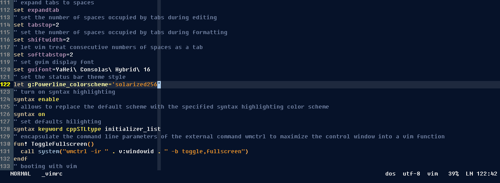

## winX 的 gvim 配置项


### 前言


#### 精简配置

按照 `use_vim_as_ide` 的配置， `windows` 需要的环境略显不同。
`unix` 或 `linux` 的环境相对比较完善，而如果你的开发需求不是使用 `vim` 作为 `c++` 的主要开发工具的话
你完全可以精简自己的配置文件。

#### 适配程度

`unix` 和 `linux` 都有源码编译的版本，`windows` 因为字体、字符集、配置路径等小因素，
导致我们 `windows` 的工具无法完美的和 `linux` 的 `vim` 编辑器相适配。


#### 突破点

`gvim` 的版本信息：

```text
$ vim --version
VIM - Vi IMproved 8.2 (2019 Dec 12, compiled Dec 15 2019 23:09:58)
MS-Windows 32 位控制台版本
包含补丁: 1-12
编译者 appveyor@APPVYR-WIN
巨型版本 无图形界面。  可使用(+)与不可使用(-)的功能:
+acl                +eval               +multi_byte_ime/dyn -tag_old_static
+arabic             +ex_extra           +multi_lang         -tag_any_white
+autocmd            +extra_search       +mzscheme/dyn       +tcl/dyn
+autochdir          -farsi              -netbeans_intg      +termguicolors
+autoservername     +file_in_path       +num64              +terminal
-balloon_eval       +find_in_path       +packages           -termresponse
+balloon_eval_term  +float              +path_extra         +textobjects
-browse             +folding            +perl/dyn           +textprop
++builtin_terms     -footer             +persistent_undo    -tgetent
+byte_offset        +gettext/dyn        +popupwin           +timers
+channel            -hangul_input       -postscript         +title
+cindent            +iconv/dyn          +printer            -toolbar
+clientserver       +insert_expand      +profile            +user_commands
+clipboard          +job                +python/dyn         +vartabs
+cmdline_compl      +jumplist           +python3/dyn        +vertsplit
+cmdline_hist       +keymap             +quickfix           +virtualedit
+cmdline_info       +lambda             +reltime            +visual
+comments           +langmap            +rightleft          +visualextra
+conceal            +libcall            +ruby/dyn           +viminfo
+cryptv             +linebreak          +scrollbind         +vreplace
+cscope             +lispindent         +signs              +vtp
+cursorbind         +listcmds           +smartindent        +wildignore
+cursorshape        +localmap           +sound              +wildmenu
+dialog_con         +lua/dyn            +spell              +windows
+diff               +menu               +startuptime        +writebackup
+digraphs           +mksession          +statusline         -xfontset
-dnd                +modify_fname       -sun_workshop       -xim
-ebcdic             +mouse              +syntax             -xpm_w32
+emacs_tags         -mouseshape         +tag_binary         -xterm_save
     系统 vimrc 文件: "$VIM\vimrc"
     用户 vimrc 文件: "$HOME\_vimrc"
 第二用户 vimrc 文件: "$HOME\vimfiles\vimrc"
 第三用户 vimrc 文件: "$VIM\_vimrc"
      用户 exrc 文件: "$HOME\_exrc"
  第二用户 exrc 文件: "$VIM\_exrc"
       defaults file: "$VIMRUNTIME\defaults.vim"
编译方式: cl -c /W3 /nologo  -I. -Iproto -DHAVE_PATHDEF -DWIN32  -DFEAT_CSCOPE -DFEAT_TERMINAL -DFEAT_SOUND  -DFEAT_JOB_C
HANNEL      -DWINVER=0x0501 -D_WIN32_WINNT=0x0501 /MP -DHAVE_STDINT_H /Ox /GL -DNDEBUG /arch:IA32 /Zl /MT -DFEAT_MBYTE_IME -DDYNAMIC_IME -DDYNAMIC_ICONV -DDYNAMIC_GETTEXT -DFEAT_TCL -DDYNAMIC_TCL -DDYNAMIC_TCL_DLL=\"tcl86t.dll\" -DDYNAMIC_TCL_VER=\"8.6\" -DFEAT_LUA -DDYNAMIC_LUA -DDYNAMIC_LUA_DLL=\"lua53.dll\" -DFEAT_PYTHON -DDYNAMIC_PYTHON -DDYNAMIC_PYTHON_DLL=\"python27.dll\" -DFEAT_PYTHON3 -DDYNAMIC_PYTHON3 -DDYNAMIC_PYTHON3_DLL=\"python37.dll\" -DFEAT_MZSCHEME -I "C:\Program Files (x86)\Racket\include" -DMZ_PRECISE_GC -DDYNAMIC_MZSCHEME -DDYNAMIC_MZSCH_DLL=\"libracket3m_a36fs8.dll\" -DDYNAMIC_MZGC_DLL=\"libracket3m_a36fs8.dll\" -DFEAT_PERL -DPERL_IMPLICIT_CONTEXT -DPERL_IMPLICIT_SYS -DDYNAMIC_PERL -DDYNAMIC_PERL_DLL=\"perl528.dll\" -DFEAT_RUBY -DDYNAMIC_RUBY -DDYNAMIC_RUBY_VER=24 -DDYNAMIC_RUBY_DLL=\"msvcrt-ruby240.dll\" -DFEAT_HUGE /Fd.\ObjCULYHTRZi386/ /Zi
链接方式: link  /nologo /opt:ref /LTCG:STATUS oldnames.lib kernel32.lib advapi32.lib shell32.lib gdi32.lib  comdlg32.lib
ole32.lib netapi32.lib uuid.lib /machine:i386   libcmt.lib  user32.lib  /nodefaultlib:lua53.lib  /STACK:8388608  /nodefaultlib:python27.lib /nodefaultlib:python37.lib   "C:\Tcl\lib\tclstub86.lib" winmm.lib WSock32.lib /PDB:vim.pdb -debug

```

#### 可选项：源码编译

关于编译器 `cl` ：

> `cl.exe` 是控制 `Microsoft C ++` （`MSVC`）`C` 和 `C ++` 编译器和链接器的工具。 
> `cl.exe` 只能在支持`Windows` 的 `Microsoft Visual Studio` 的操作系统上运行。

关于编译器的详细信息：

请参考：[Compiler Options](https://docs.microsoft.com/en-us/cpp/build/reference/compiler-options?redirectedfrom=MSDN&view=msvc-160)

如果需要自己编译，可以根据上面的版本信息的输编译方式节点的内容，自定义您自己的配置项。

当然，源码需要到 `vim` 的 `github` 页上寻找


### 所需环境

如果直接使用，不想配置关于 `C++` 更多的内容，你可以参考我目前配置的 gvim 截屏。

同样的，你可以按照 [use_vim_as_ide](https://github.com/yangyangwithgnu/use_vim_as_ide)  的讲解
，在 `ubuntu` , `susu`, `redhat` 等 `linux` 发行版系统或 `mac book` 上配置你的专属 `IDE`
 
如果仅仅是使用以上配置的常用插件功能，您可以按照如下的提示配置你的 gvim：

- python 2.7 32 bit 安装包
- python 3.7 32 bit 安装包
- ctags 安装包
- gvim 8.2 的安装包

这些文件会在 release 版本中


### 配置 vundle 插件管理包

如果你按照 use_vim_as_ide 的配置方式，直接克隆到 HOME 目录下， 那么有可能  vundle 并不会启动。

原因实际上源自系统的隔膜。

当然，好的方式是直接切换到安装 VIM 的路径中，然后克隆到对应版本文件目录下的 vundle 目录中

例如：

如果是 82 版本的，那么你可以切换到 82版本的目录下 ，然后克隆 vundle 至 对应的目录

```bash
gcl https://github.com/VundleVim/Vundle.vim.git bundle/Vundle.vim
```

###配置插件

剩下的就是配置您的 `_vimrc` 文件， 你可以复制代码根目录下的示例文件，然后覆盖其内容到你的本地目录。
再根据对应的内容，修改其对应的目录参数。

### 关于字体文件


字体文件我也会放在项目的根目录，`windows` 系统，下载完成即可双击安装字体。


### 关于配置参数参考

如果不想下载后打开，直接拷贝以下的配置项到你的 `_vimrc` 文件中

### 安装插件

安装插件的方式：

```
:PluginInstall
````


